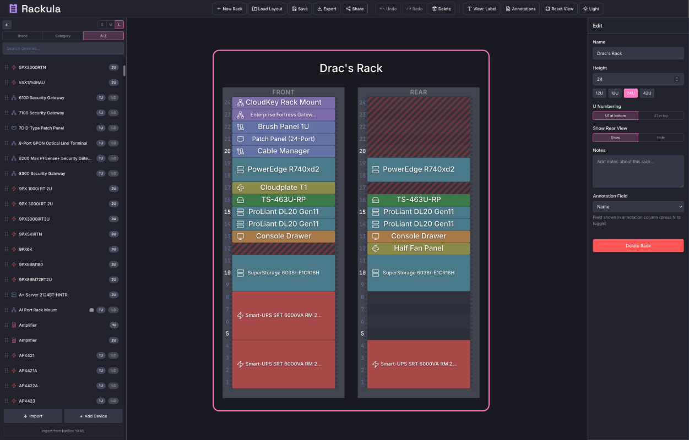

# Rackula

> A drag-and-drop rack visualizer for homelab planning — built with Dracula.

## About

Rackula helps you plan and document your homelab rack layouts with an intuitive drag-and-drop interface. Designed from the ground up with the Dracula color palette.

## Install

All instructions can be found at [draculatheme.com/rackula](https://draculatheme.com/rackula).

## Team

This app is maintained by the following person(s) and a bunch of [awesome contributors](https://github.com/ggfevans/Rackula/graphs/contributors).

|  |
| --- |
| [Gareth Evans](https://github.com/ggfevans) |

## Community

- [Twitter](https://twitter.com/draculatheme) - Best for getting updates about themes and new stuff.
- [GitHub](https://github.com/dracula/dracula-theme/discussions) - Best for asking questions and discussing issues.
- [Discord](https://draculatheme.com/discord-invite) - Best for hanging out with the community.

## Dracula PRO

## License

[MIT License](./LICENSE)
